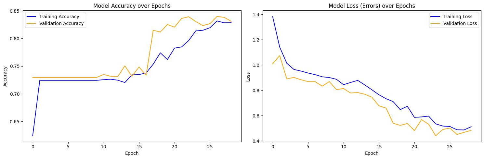
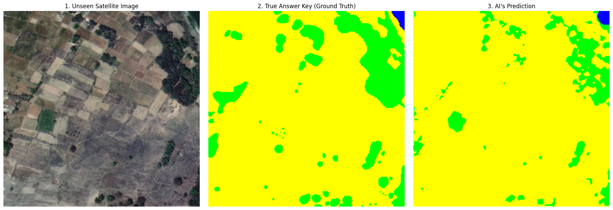

# 🛰️ ISRO Bhuvan Satellite Image Segmentation (U-Net)

## 📌 Project Overview
This project implements an end-to-end Deep Learning pipeline to perform semantic segmentation on high-resolution 2D satellite imagery of Varanasi, India, sourced from the Indian Space Research Organisation (ISRO). 

Using a custom-built **U-Net Convolutional Neural Network (CNN)**, the model performs pixel-level classification to identify and separate different geographical land covers into 5 distinct classes: Urban, Water, Forest, Agriculture, and Road.

## 🛠️ Tech Stack & Libraries
* **Framework:** TensorFlow / Keras
* **Data Processing:** NumPy, OpenCV (`cv2`), Pandas, Scikit-learn
* **Data Pipeline:** `tf.data.Dataset` API
* **Visualization:** Matplotlib

## 📂 Dataset
The dataset consists of high-resolution satellite images and their corresponding color-coded human-annotated masks. 
* **Classes:** * 🟨 Agriculture `[255, 255, 0]`
  * 🟦 Water Bodies `[0, 0, 255]`
  * 🟩 Forest `[0, 255, 0]`
  * 🟪 Roads `[255, 0, 255]`
  * cyan Urban Areas `[0, 255, 255]`

## 🚀 Pipeline & Architecture

### 1. High-Performance Data Pipeline
* Implemented automatic preprocessing to map raw RGB masks to integer-based class IDs.
* Utilized the `tf.data` API to create highly efficient "conveyor belts" for training and validation data, utilizing `batching(8)` and background `prefetching(AUTOTUNE)` to maximize GPU utilization.

### 2. U-Net Architecture (Built from Scratch)
Designed a functional U-Net model optimized for semantic segmentation:
* **Encoder:** Convolutional and MaxPooling layers to extract deep spatial features and reduce dimensionality.
* **Bottleneck:** The deepest layer holding the most complex pattern recognition.
* **Decoder & Skip Connections:** `Conv2DTranspose` layers to upscale the image back to 256x256. Crucially, implemented Skip Connections (`Concatenate`) to bridge high-resolution localization data directly from the Encoder to the Decoder.
* **Parameters:** ~466,000 trainable parameters.

### 3. Training & Callbacks
* **Optimizer:** Adam
* **Loss Function:** `SparseCategoricalCrossentropy`
* **Callbacks:** `ModelCheckpoint` (saving the best weights) and `EarlyStopping` (preventing overfitting with a patience of 5 epochs).
* **Result:** Achieved **~83% Validation Accuracy** using a highly constrained training set of only 50 images.

## 📊 Results & Inference

The model demonstrates a strong ability to generalize geographical macro-structures...
The model demonstrates a strong ability to generalize geographical macro-structures. During inference on entirely unseen data (`test_image` directory), the model accurately segmented complex river boundaries and vast agricultural zones, proving the mathematical viability of the custom architecture.

## 💻 How to Use
1. Clone this repository.
2. Open the notebooks in Google Colab (Recommended for free T4 GPU access).
3. Run them to explore the data and verify mask logic.

---

 ## **Thank You**
